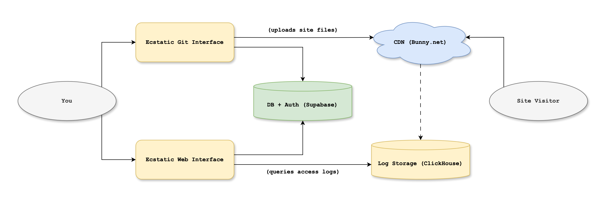

# Technical Overview

> Please note that this page is **not required reading to know how to use Ecstatic** -- it is "just for fun", for developers who want to know what's running under the hood!

### Design

The Ecstatic flow isn't very complicated. It involves a few services and a few databases:

* You push your site's source code to Ecstatic
* Ecstatic builds the site and uploads the result to the CDN
* Visitors connect to the CDN to view your site
* The CDN forwards access logs to Ecstatic's timeseries DB
* The Ecstatic web app queries the timeseries DB for analytics

This same flow can be seen in the chart below, for the more visually-oriented, with the yellow boxes representing Ecstatic services:

  

This design is the result of a lot of iteration, and I think it represents a "local maximum" in terms of ease of use and resilience. This is to say -- no part of Ecstatic going down will ever mean a visitor can't load an Ecstatic site, which is the most important thing.

### Infrastructure

Ecstatic is currently run entirely on one server, located in Germany and rented from [Hetzner](https://www.hetzner.com/). It does not use any cloud services, like load balancers or serverless functions.

On that server, there's only one custom service running under `systemd`, which is [k3s](https://k3s.io/). This is a single-binary distribution of Kubernetes which is robust but quick to set up on individual machines.

All the rest of Ecstatic is run on this Kubernetes distribution and managed via [Helm](https://helm.sh/) charts.

There are two "platform-level" services.

* [Caddy](https://caddyserver.com/), the load balancer and reverse proxy. It gets certificates from [Let's Encrypt](https://letsencrypt.org/) and terminates SSL so the downstream services don't need to worry about it. All traffic, L4 and L7, flows through Caddy, and it's the only service exposed to the Internet.
* [Prometheus](https://prometheus.io/), which is our telemetry hub. Each pod exposes data on a `/metrics` endpoint, and this service scrapes those endpoints every few seconds, aggregates, stores, and graphs that data.

The other services are custom Ecstatic code, written in Golang, and they can be found [here](https://github.com/ecstaticsites/go).

### Service 1: `api`

[View the code](https://github.com/ecstaticsites/go/tree/main/cmd/api)

This is the administrative service, which has endpoints for things like creating and updating existing sites. Because of this, it will only ever handle a pretty small amount of traffic.

It's also the only service that has access to certain admin API keys, none of the others do.

### Service 2: `git`

[View the code](https://github.com/ecstaticsites/go/tree/main/cmd/git)

This is the service behind `git.ecstaticsites.com`, which pretends to be a Git server, in order to receive files from a user's `git push`, and uploads those files to the CDN.

### Service 3: `intake`

[View the code](https://github.com/ecstaticsites/go/tree/main/cmd/intake)

This is the small data-processing pipeline. Bunny CDN forwards access logs to this service over TCP, where they are then parsed, lightly validated, and stored in Clickhouse on a per-site basis.

### Service 4: `query`

[View the code](https://github.com/ecstaticsites/go/tree/main/cmd/query)

Finally, this is the service that handles queries for metric data. Its job is small, in that it only receives requests, validates that the client is indeed able to access the hostname they're querying, and creates a query to Clickhouse to return the data.
